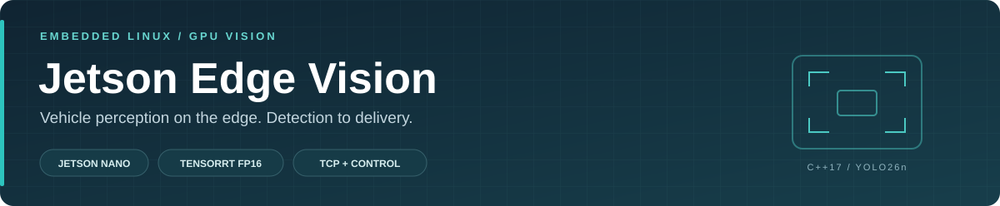
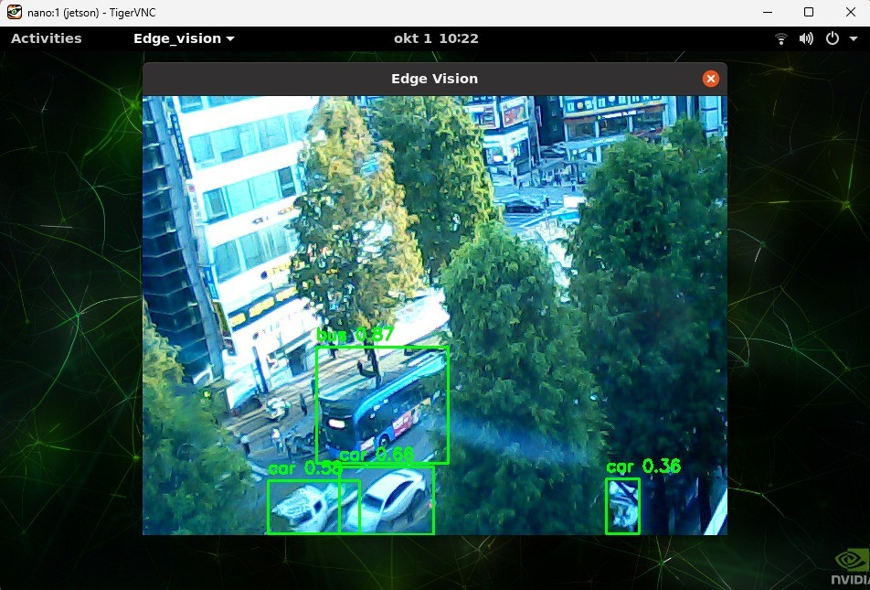
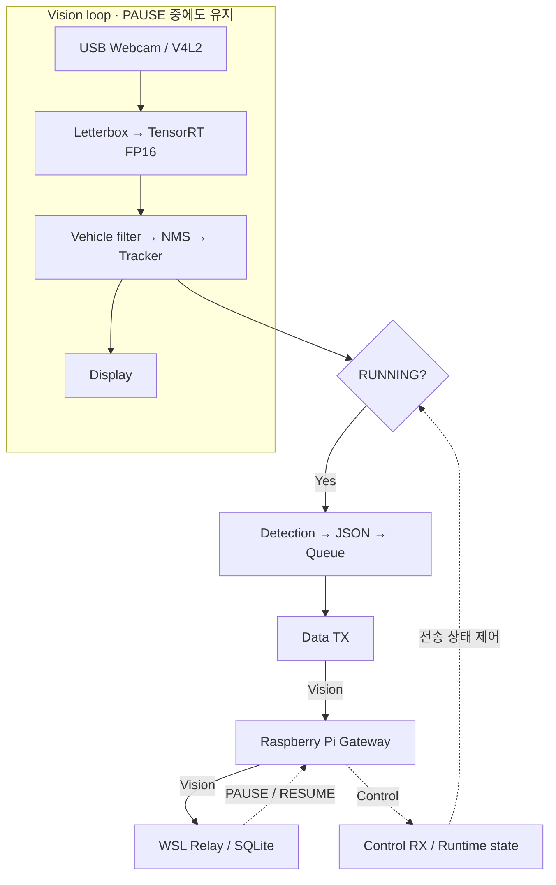

<p align="center">
  
</p>

<p align="center">
  
  
  
  
  
</p>

<p align="center">
  <a href="#demo">Demo</a> · <a href="#performance">Performance</a> · <a href="#architecture">Architecture</a> · <a href="#vehicle-tracking">Tracking</a> · <a href="#validation">Validation</a> · <a href="#build">Build</a>
</p>

# Jetson Edge Vision

**USB Webcam의 차량을 인지하고, 객체별 JSON을 Raspberry Pi Gateway로 전달하는 C++17 Vision Client입니다.**

[Raspberry Pi Edge Vision](https://github.com/triton0305/raspberry-pi-edge-vision)의 OpenCV DNN / CPU 추론을 **TensorRT FP16 / CUDA GPU 추론**으로 전환했습니다. Vision 연속 송신과 Control 수신을 분리하고, 서버 장애 시 PAUSE·복구 시 RESUME으로 전송 상태를 제어합니다.

## Development History

| 날짜 | 개발 내용 |
|---|---|
| [2026.09.30](https://github.com/triton0305/jetson-edge-vision/commit/1dd62da4ebb6ca4ef49b82abcf30a3e654c29595) | Jetson Nano 이식 및 TensorRT FP16 GPU 추론 전환 |
| [2026.10.01](https://github.com/triton0305/jetson-edge-vision/commit/dd5f1f17d7398a244669e689ed74bd0ac0cf197a) | Network / Control 및 장애·복구 처리 구현 |
| [2026.10.06](https://github.com/triton0305/jetson-edge-vision/commit/703e7b87ce4ed206c1cfbb48b78ca949c2699927) | 경량 차량 Tracking 추가 및 실행 스크립트 정리 |

## Demo

<p align="center">
  
</p>
<p align="center"><sub>2026.10.01 실제 USB Webcam / TensorRT 실행 화면</sub></p>

| 영상 처리 | GPU 추론 | Pi 대비 처리 속도 |
|:---:|:---:|:---:|
| **약 12 FPS** | **약 55 ms** | **약 5.2–5.5배** |
| Effective FPS | 평균 TensorRT 추론 시간 | 기존 CPU 실행 로그 대비 |

> 동일 장소의 실시간 영상으로 측정했으며 차량 수와 장면은 서로 다릅니다. 아래 Performance에서 측정 범위를 확인할 수 있습니다.

## Performance

동일 장소의 실시간 카메라 영상으로 Raspberry Pi와 Jetson Nano의 실행 성능을 측정했습니다.

| 지표 | Raspberry Pi 4 | Jetson Nano |
|---|---|---|
| 추론 방식 | OpenCV DNN / CPU | TensorRT FP16 / GPU |
| Effective FPS | 약 2.2–2.3 FPS | 약 11.9–12.0 FPS |
| 평균 추론 시간 | 약 410–490 ms | 약 54.5–54.6 ms |

측정값 기준 영상 처리 속도는 약 5.2–5.5배 증가했고, 평균 추론 시간은 약 87–89% 감소했습니다. 동일 장소에서 측정했으나 실시간 영상의 차량 수와 장면은 서로 다릅니다.

Effective FPS는 영상 처리 속도이며, Produced/Sent Vision msg/s는 객체별 메시지 생성·송신 처리량입니다. 한 프레임에서 여러 차량을 탐지할 수 있으므로 메시지 처리량은 FPS보다 높을 수 있습니다.

## Key Features

| 영역 | 구현 내용 |
|---|---|
| **Perception** | `car`, `motorcycle`, `bus`, `truck` · TensorRT FP16 · Class-aware NMS |
| **Tracking / Display** | 경량 차량 ID 연결 · 0.8초 미검출 Track 정리 · class / ID / confidence 표시 |
| **Delivery** | Detection 1개당 JSON 1개 · Message Queue · Data TX / Control RX 분리 |
| **Recovery** | PAUSE 시 대기 큐 폐기 · 재연결 후 세션 동기화 · RESUME 후 새 결과부터 송신 |
| **Operations** | Queue / Drop / Link / Reconnect 지표 · `/opt`, `/var/lib` 운영 배포 |

전송 JSON은 객체별 Detection 형식이며 고유 차량 수·통과 교통량을 의미하지 않습니다.

## Changes from Raspberry Pi

<details>
<summary><strong>CPU → GPU 전환과 전송 정책 변경 보기</strong></summary>

| **항목** | **Raspberry Pi Edge Vision** | **Jetson Edge Vision** |
|---|---|---|
| 장비 | Raspberry Pi 4 | NVIDIA Jetson Nano |
| 추론 | OpenCV DNN / CPU | TensorRT / CUDA GPU |
| 모델 | YOLO26n ONNX | YOLO26n FP16 engine |
| Detector | OpenCV DNN 모델 로딩·추론 | TensorRT engine·CUDA 버퍼 관리 |
| 카메라 | V4L2 | V4L2 / YUYV 명시 |
| 이미지 저장 | 최초 탐지 스냅샷 | 실시간 표시만 수행 |
| Tracking | 미사용 Tracker 소스 잔존 | 후속 경량 Tracker 구현 · 내부 ID 표시 · 기존 Detection 전송 유지 |
| 교통량 집계 | traffic_count 소스 잔존 | Line Crossing·traffic_count 미구현 |

Letterbox, 차량 필터링, Class-aware NMS와 기존 `vision` JSON 의미는 유지합니다. Vision의 application ACK/Retry는 제거했습니다.

</details>

## Architecture



| **Stage** | **Flow** |
|---|---|
| **① Vision Loop** | USB Webcam / V4L2 → Letterbox 640×640 → TensorRT → Class-aware NMS → Tracker → Display |
| **② Message Generation** | Tracker 결과의 원본 Detection → 객체별 vision JSON → Message Queue |
| **③ Delivery** | Data TX → Pi Gateway → WSL Final Server |

| **Component** | **Responsibility** |
|---|---|
| **Vision Client** | 프레임 획득, 전처리·추론·후처리, 내부 Tracking·화면 표시, Detection 생성 및 전송 |
| **Pi Gateway** | Vision 전달, downstream Control 전달 |
| **WSL Final Server** | 최종 데이터 처리 및 SQLite 저장 |

현재 검증 환경에서는 Jetson → Pi Gateway 구간에 TCP 8000, Pi Gateway → WSL Final Server 구간에 TCP 9000을 사용했습니다. 포트 번호는 고정 프로토콜 요구사항이 아니며 실행·배포 환경에 맞게 지정할 수 있습니다.

## Network / Control

| 상태 | 영상 처리·Tracking·표시 | JSON 생성·전송 | 대기 데이터 |
|---|---|---|---|
| **RUNNING** | 유지 | 새 Detection을 연속 송신 | 최대 16개 Queue |
| **PAUSED** | 유지 | JSON/ID 생성·enqueue 차단 | Queue 폐기 |
| **재연결 직후** | 유지 | 현재 세션의 `resume`까지 대기 | 과거 데이터 replay 없음 |

DB 장애는 WSL → Pi → Jetson으로 PAUSE를 전달하며, 복구 후 새 결과부터 송신합니다. 이미 송신을 시작했거나 TCP 버퍼에 들어간 바이트는 회수할 수 없습니다.

<details>
<summary><strong>연결·재시도·Timeout·Control 검증·Metrics 상세</strong></summary>

Jetson은 Pi Gateway와 TCP로 연결하고, Pi Gateway는 WSL Final Server와 별도 TCP 연결을 유지합니다. 현재 실환경 검증에서는 각각 8000과 9000을 사용했습니다.

하나의 Jetson↔Pi 연결에서 Data TX가 Vision을 보내고 Control RX가 Control을 받습니다. Control RX가 연결과 재연결을 관리하므로 Queue가 비어 있거나 PAUSED여도 재연결합니다.

- 시작과 재연결 직후 PAUSED. 현재 세션의 `resume` Control을 받아야 RUNNING입니다.
- `pause`는 Camera, TensorRT, Detection, Display를 유지하며 JSON/ID 생성과 enqueue를 차단하고 Queue를 비웁니다.
- 상태 변경 번호로 PAUSE/RESUME을 가로지른 프레임과 이전 대기 메시지를 폐기합니다.
- 송수신 실패는 `pi_connection_lost`, 연결 성공은 `pi_connection_restored`로 표시합니다.
- 전달받은 downstream reason은 그대로 표시합니다. 실패한 Vision을 재전송하지 않습니다.
- 이미 송신을 시작했거나 TCP 버퍼에 들어간 바이트는 PAUSE로 회수할 수 없습니다. 새 송신을 차단하고 복구 시 replay하지 않습니다.
- Queue 최대 16개, overflow 시 가장 오래된 메시지를 폐기합니다.
- 연결 시도 제한 1초, 재시도 간격 1초. 송신 prefix/payload 각각 최대 1초입니다.
- Control idle timeout은 없습니다. Linux TCP keepalive(10초 idle, 3초 interval, 3 probes)와 TCP_USER_TIMEOUT(20초)을 설정합니다. 실제 장애 검출 시간은 커널·네트워크 상태에 따릅니다.
- 종료 시 Queue를 닫고 socket shutdown으로 blocking I/O를 깨운 뒤 join합니다.

Control은 version 1 envelope와 문자열 device_id/message_id, 정수 timestamp_ms, 문자열 action/reason을 요구합니다. action은 소문자 `pause` 또는 `resume`입니다.

잘못된 JSON/Control은 무시하며, 길이 0 또는 1 MiB 초과 framing은 연결을 종료합니다.

Metrics는 FPS, Inference, Produced/Sent msg/s, Queue depth, Overflow drop, PAUSE discard, Network State, Pi Link, Pause Reason, Reconnect count를 출력합니다.

최초 연결은 reconnect count에 포함하지 않습니다. Discard에는 장애 전환 때 버린 pending 메시지와 이미 pop한 전송 불가 메시지를 포함합니다.

</details>

## Vehicle Tracking

차량의 Bounding Box를 프레임 간 연결하여 **같은 차량의 ID를 유지하고 화면에 표시하는 경량 Tracker**입니다. 별도 추적 모델 없이 같은 클래스의 위치 정보를 비교하며, NMS 후·화면 표시 전에 실행합니다.

| 항목 | 동작 |
|---|---|
| 연결 대상 | 같은 클래스의 Detection과 기존 Track |
| 연결 조건 | **IoU ≥ 0.10 또는 중심 거리 ≤ 160 px** · 원본 프레임 좌표 기준 |
| 후보 선택 | Detection 입력 순서대로 IoU가 가장 큰 후보 선택 → 동률이면 중심 거리가 가까운 후보 |
| 중복 연결 방지 | 한 프레임에서 각 Track은 하나의 Detection에만 연결 |
| 유지 시간 | 마지막 검출 이후 **0.8초 미만**이면 연결 후보로 유지 |
| 만료 처리 | **0.8초 이상 미검출**이면 다음 update에서 matching 전에 삭제 |
| ID 관리 | 새 Track에 증가하는 ID 부여 · 같은 실행에서 삭제 ID 재사용 없음 |

**0.8초는 ID 교체 주기가 아니라 미검출 허용 시간입니다.** 계속 검출되면 마지막 검출 시간이 갱신되어 같은 ID를 유지합니다. 잠시 놓친 차량은 0.8초 안에 다시 검출되고 연결 조건을 만족하면 기존 ID로 연결됩니다.

Track을 보관하는 동안에도 현재 프레임에서 검출되지 않은 차량의 과거 Bounding Box는 표시하거나 송신하지 않습니다. PAUSE 중에도 영상 처리와 Tracker 갱신은 계속됩니다.

`track_id`는 Jetson 내부 표시용이며 **Vision JSON에는 포함하지 않습니다.** 동일 ID도 현재 프레임에서 검출될 때마다 기존 방식으로 객체별 Vision을 생성합니다. 고유 차량 수·통과 교통량 집계는 포함하지 않습니다.

<details>
<summary><strong>테스트·실행 기록과 적용 범위</strong></summary>

기존 2026.10.02 기록에서 전체 빌드와 Tracker / Network / Transport 테스트 3개가 통과했습니다. Tracker 테스트는 ID 유지, 같은 클래스·일대일 연결, 800 ms 만료 경계, 빈 Detection 처리, 삭제 ID 재사용 금지 및 Tracking 전후 JSON 일치를 확인했습니다.

실제 USB 카메라·TensorRT와 localhost Gateway로 약 91초 실행하여 Vision 244개 수신, 기존 JSON 필드 유지 및 중복 message_id 없음을 확인했습니다. 이 실행은 실제 Pi / WSL / SQLite 전체 경로의 검증이 아니며, Tracking 추가 버전의 외부 E2E는 미검증입니다.

밀집·교차·빠른 이동·클래스 변동 상황의 ID 유지 품질은 별도 실영상 관찰이 필요합니다. 현재 구현은 Bounding Box 기반 greedy 연결 방식이며, 0.8초 유지가 모든 상황에서 동일 차량 ID를 보장하지는 않습니다.

구현: [tracker.hpp](include/vision/tracker.hpp) · [tracker.cpp](src/vision/tracker.cpp)

</details>

## Validation

아래 결과는 **2026.10.01 기본 시스템의 실환경 검증 기록**입니다.

| 검증 단계 | 환경 | 확인 결과 |
|---|---|---|
| **기본 Network / Control** | Jetson → 실제 Pi → WSL → SQLite | 전체 저장 경로, DB 장애·복구 PAUSE/RESUME, Jetson↔Pi 연결 장애·복구 검증 |

상세 기록: **[Network validation](docs/network-validation.md)**

<details>
<summary><strong>테스트 실행 방법과 검증 항목</strong></summary>

```bash
cmake --build build -j2
(cd build && ctest --output-on-failure)
./build/bin/edge_vision <pi_gateway_ip> 8000
```

`network_integration_test`는 실제 localhost TCP socket으로 ACK 없는 송신, 분할 Control, PAUSE/RESUME, 초기 접속 실패 후 재시도, 새 세션 동기화, stale 데이터 차단, Queue 경쟁, blocking receive 종료를 검증합니다.

`network_transport_test`는 Partial write, EINTR/EAGAIN, 송신 deadline, 동시 TX/RX 및 reconnect 등 TCP transport 동작을 검증합니다.

Jetson → Raspberry Pi Gateway → WSL Final Server → SQLite 전체 경로와 PAUSE/RESUME, DB 장애·복구, Jetson↔Pi 연결 장애·복구를 실환경에서 검증했습니다.

상세 검증 범위와 미검증 항목은 [docs/network-validation.md](docs/network-validation.md)를 참고합니다.

</details>

## Build

### Requirements

- C++17 compiler / CMake 3.16 이상
- OpenCV: core, imgproc, highgui, videoio, dnn
- CUDA / TensorRT: 현재 binding 기반 `enqueueV2`·`destroy` API 지원 환경
- nlohmann/json
- 대상 Jetson 환경에 호환되는 `models/yolo26n_fp16.engine`

Engine은 별도로 준비합니다. 현재 Detector가 사용하는 I/O 규격은 다음과 같습니다.

| **Binding** | **Shape** | **Type** |
|---|---|---|
| images | 1×3×640×640 | FP32 |
| output0 | 1×84×8400 | FP32 |

FP16은 engine 내부 연산 정밀도입니다. 코드가 engine의 실제 shape·type을 검증하지 않으므로 위 규격에 맞는 engine을 사용해야 합니다.

```bash
cmake -S . -B build -DCMAKE_BUILD_TYPE=Release
cmake --build build -j2
```

### Development Run

```bash
./build/bin/edge_vision <pi_gateway_ip> <pi_gateway_port>
```

| **항목** | **개발 경로** |
|---|---|
| Model | models/yolo26n_fp16.engine |
| Boot ID | boot_id.dat |

모델과 boot_id는 Git에 포함하지 않습니다. boot_id가 없으면 생성하므로 부모 디렉터리에 쓰기 권한이 필요합니다. 실시간 화면 표시를 위한 GUI / X 인증 환경이 필요하며 Esc 또는 Ctrl+C로 종료합니다.

## Deployment

<details>
<summary><strong>운영 계정·설치·실행 방법</strong></summary>

운영 계정 `edgevision`의 video 그룹, 모델 읽기 권한, boot_id 파일·디렉터리 쓰기 권한과 TigerVNC / X 인증 환경을 준비합니다.

```bash
cmake -S . -B build-deploy -DCMAKE_BUILD_TYPE=Release \
  -DCMAKE_INSTALL_PREFIX=/opt/edge_vision \
  -DMODEL_PATH=/opt/edge_vision/models/yolo26n_fp16.engine \
  -DBOOT_ID_PATH=/var/lib/edge_vision/boot_id.dat

cmake --build build-deploy -j2
sudo cmake --install build-deploy
```

| **항목** | **운영 경로** |
|---|---|
| Binary | /opt/edge_vision/bin/edge_vision |
| Model | /opt/edge_vision/models/yolo26n_fp16.engine |
| Boot ID | /var/lib/edge_vision/boot_id.dat |
| XAUTHORITY | /home/edgevision/.Xauthority |

설치 명령은 바이너리만 배치합니다. 모델·계정·상태 디렉터리는 별도로 준비합니다.

### Production Run

저장소 루트에서 실행합니다.

```bash
./run <pi_gateway_ip> <pi_gateway_port>
```

`run`은 운영 바이너리를 edgevision 계정으로 실행하며 DISPLAY(기본 `:1`)와 XAUTHORITY를 전달합니다. TigerVNC `:1`을 지정하려면 다음과 같이 실행합니다.

```bash
DISPLAY=:1 ./run <pi_gateway_ip> <pi_gateway_port>
```

</details>

## Message Protocol

<details>
<summary><strong>Vision / Control JSON과 필드 정의</strong></summary>

Vision과 Control은 `4-byte big-endian payload length + JSON` 형식입니다.

```json
{
  "version": 1,
  "type": "vision",
  "device_id": "vision-pi-01",
  "message_id": "vision-pi-01-000059-00000001",
  "data": {
    "frame_id": 0,
    "timestamp_ms": 1790580489875,
    "class_id": 2,
    "class_name": "car",
    "confidence": 0.85,
    "bbox": {
      "x": 131,
      "y": 328,
      "width": 85,
      "height": 70
    }
  }
}
```

```json
{
  "version": 1,
  "type": "control",
  "device_id": "gateway",
  "message_id": "control-1",
  "data": {
    "timestamp_ms": 1790580489875,
    "action": "resume",
    "reason": "wsl_connection_restored"
  }
}
```

| **필드** | **기준** |
|---|---|
| message_id | device_id + 실행마다 증가하는 영속 boot_id + 객체별 sequence |
| frame_id | 실행 내 프레임 번호, 0부터 시작 |
| timestamp_ms | 프레임 읽기 완료 직후 Unix ms |
| bbox | 원본 프레임 좌측 상단 기준 픽셀 좌표·크기 |

현재 `device_id`는 기존 Raspberry Pi 구현과의 메시지 호환성을 유지하기 위해 `vision-pi-01`을 사용합니다. 여러 장비 운영 시 장비별 ID를 구분하고 기존 boot_id를 초기화하지 않습니다.

</details>

## Scope and Data Semantics

- 카메라는 YUYV 640×480@30을 요청하며 실제 처리 FPS와 구분합니다.
- Confidence threshold는 0.25, NMS IoU threshold는 0.45입니다.
- 탐지가 없는 프레임은 메시지를 생성하지 않습니다.
- 동일 차량의 반복 탐지는 별도 이력이며 고유 차량 수·통과 교통량을 의미하지 않습니다.
- Line Crossing, traffic_count, 고유 차량 수 집계, 녹화·스냅샷 저장 기능은 Runtime에 포함하지 않습니다.
- 시간 구간별 집계와 데이터 보관 정책은 수신 서버의 후처리 영역입니다.

## Project Structure

<details>
<summary><strong>소스 디렉터리와 책임</strong></summary>

| **경로** | **역할** |
|---|---|
| include/ · src/core/ | 설정, Boot ID, Message ID, Runtime State, Metrics |
| include/ · src/vision/ | Camera, 전처리, TensorRT 추론, 후처리, Tracker, VisionWorker 표시 |
| include/ · src/protocol/ | JSON 직렬화 및 메시지 형식 |
| include/ · src/network/ | Queue, TCP, Control RX, Data TX, Reconnect |
| src/main.cpp | 초기화 및 Runtime 관리 |
| tests/ | Tracker / Network / Transport 자동 검증 |
| test/ | 원본 프로젝트의 수동 검증 이미지 |

</details>

## Related Repositories

| 저장소 | 역할 |
|---|---|
| **이 저장소 · Jetson Edge Vision** | TensorRT 차량 인지 · Vision 송신 |
| [Raspberry Pi Edge Vision Gateway](https://github.com/triton0305/raspberry-pi-edge-vision-gateway) | Vision 중계 · downstream Control 전달 |
| [Jetson Edge Vision Relay Server](https://github.com/triton0305/jetson-edge-vision-relay-server) | Vision 수신 · SQLite 저장 · DB 상태 Control 생성 |
| [Raspberry Pi Edge Vision](https://github.com/triton0305/raspberry-pi-edge-vision) | OpenCV DNN / CPU 기반 원본 프로젝트 |
