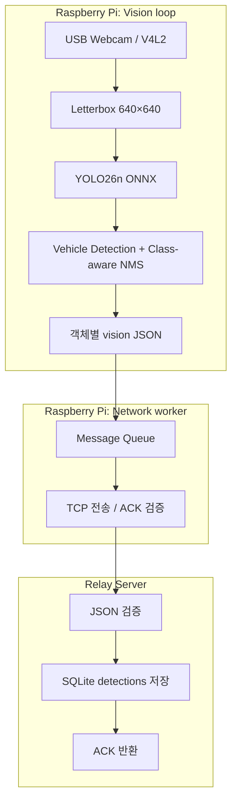

# Raspberry Pi Edge Vision

Raspberry Pi 4에서 USB Webcam 영상을 YOLO26n ONNX로 처리해 차량 Detection을 생성하는 C++17 Vision Client입니다. 탐지 객체마다 JSON 메시지를 만들고, 별도 네트워크 스레드에서 TCP/ACK로 전달합니다. 팀프로젝트의 Client/Server 경계에 맞춰 구현했으며, 독립 검증용 [Relay Server](https://github.com/triton0305/edge-vision-relay-server)도 제공합니다.

## Key Features

- `car`, `motorcycle`, `bus`, `truck` 탐지 및 Class-aware NMS
- Detection 1개 = `vision` JSON 1개 = `message_id` 1개 = ACK 1개
- 영상 처리와 송신을 분리하는 유한 Message Queue와 Network Worker
- 4-byte big-endian length-prefix, partial read/write, ACK Timeout, Retry, 재연결
- 같은 메시지 재전송 시 `message_id`와 payload 유지
- FPS, 추론 시간, Queue 크기 및 Drop 수 측정

## Architecture



Detection이 없는 프레임은 전송하지 않습니다. 동일 차량이 여러 추론 프레임에서 반복 탐지되는 것은 정상이며, 각 Detection은 별도 이력입니다. 따라서 Detection 건수는 고유 차량 대수나 실제 통과량, 누적 교통량 또는 도로 전체의 혼잡도를 뜻하지 않습니다.

## Message Protocol

TCP 프레임은 `4-byte big-endian payload length + JSON payload`입니다. bbox는 원본 640×480 프레임의 픽셀 좌표이고, `timestamp_ms`는 프레임 획득 시각의 Unix ms입니다.

```json
{
  "version": 1,
  "type": "vision",
  "device_id": "vision-pi-01",
  "message_id": "vision-pi-01-000059-00000001",
  "data": {
    "frame_id": 0,
    "timestamp_ms": 1790580489875,
    "class_id": 2,
    "class_name": "car",
    "confidence": 0.2803,
    "bbox": { "x": 131, "y": 328, "width": 85, "height": 70 }
  }
}
```

서버는 같은 length-prefix 형식으로 `{"version":1,"type":"ack","message_id":"vision-pi-01-000059-00000001","status":"ok"}`를 반환합니다. Client는 ACK를 검증하고, 실패 시 최초 시도 포함 최대 3회 동일한 메시지를 전송합니다. 연결 실패 시 재연결을 시도하며 Vision Loop는 계속 실행됩니다. 재시도 한도를 넘은 메시지는 Drop됩니다. Server Error ACK 또는 유효하지 않은 ACK는 실행 실패로 처리합니다.

## Client / Server Responsibility

| Component | Responsibility |
|---|---|
| Vision Client | 프레임 획득, 추론, 객체별 Detection 생성, JSON 직렬화, Queue 및 TCP/ACK 전달 |
| Relay Server | `vision` 검증, SQLite `detections` 저장, 동일 `message_id` 중복 방지, ACK 반환 |
| Server-side analysis | 저장된 원본의 `timestamp_ms`를 기준으로 시간 구간·차종·confidence별 Detection 통계 계산 |

5초·1분·시간대별 건수와 차종별 비율은 Detection 이력에서 서버 측 후처리로 산출할 수 있습니다. 수신 시각이 아닌 `timestamp_ms`를 구간 기준으로 사용해야 하며, 차종별 비율도 실제 차량 구성비가 아닌 Detection 결과의 비율입니다. 현재 Relay Server는 저장 및 ACK를 담당하며 통계 조회·시각화·보관 정책은 아직 구현하지 않았습니다.

## Development Environment

| Item | Environment |
|---|---|
| Board / OS | Raspberry Pi 4 / Debian GNU/Linux 13, 64-bit |
| Camera | USB Webcam, OpenCV V4L2, 640×480 (30 FPS 요청) |
| Language / Build | C++17 / CMake |
| Inference | OpenCV 4.10.0 DNN, CPU / YOLO26n ONNX, 640×640 input |
| JSON / Network | nlohmann/json / TCP, `std::thread` |

대상 COCO Class는 `car(2)`, `motorcycle(3)`, `bus(5)`, `truck(7)`입니다.

## Performance

Raspberry Pi 4 CPU에서 측정한 당시 결과이며, 장면과 실행 조건에 따라 달라집니다.

| Metric | Result |
|---|---:|
| Camera Frame Grab | 약 21.6 FPS |
| Effective FPS | 약 2.2–2.34 FPS |
| Inference Latency | 약 405–425 ms |
| Delivery Latency | 약 100–130 ms |

## Build and Run

OpenCV 개발 패키지와 nlohmann/json 헤더, `models/yolo26n.onnx` 모델 파일이 필요합니다. 모델 및 boot ID 경로는 CMake의 `MODEL_PATH`, `BOOT_ID_PATH`로 재설정할 수 있습니다. GUI 영상 출력이 가능한 환경에서 실행합니다.

```bash
cmake -S . -B build
cmake --build build -j
./build/bin/edge_vision <server_ip> <server_port>
```

서버 빌드·실행 방법은 [Relay Server README](https://github.com/triton0305/edge-vision-relay-server)를 참고하세요.

## Project Structure

```text
include/                 src/
├── core/                ├── core/
├── vision/              ├── vision/
├── protocol/            ├── protocol/
└── network/             ├── network/
                        └── main.cpp
```

`vision`은 획득·전처리·추론·후처리, `protocol`은 직렬화, `network`는 Queue·TCP·ACK, `core`는 설정·ID·Metrics를 담당합니다. `main.cpp`는 초기화와 실행·종료 흐름을 연결합니다. 저장소에 남은 Tracker/Traffic 관련 소스는 현재 실행 경로에서 호출하지 않습니다.

## Integration Verification

USB Webcam → Raspberry Pi Client → TCP → Windows/WSL Relay Server → SQLite → ACK → Raspberry Pi 흐름을 실제로 검증했습니다. 최종 Vision-only 테스트(Boot ID 59)에서 `detections`의 vision row 407건과 신규 `traffic_count` row 0건을 확인했습니다. Relay Server는 중복 `message_id`를 한 행으로 유지하고 Error ACK를 반환하는 동작도 별도 검증했습니다.

## Traffic Feature Decision

개발 중 Tracking, 기준선 통과 판정 및 5초 `traffic_count` 생성까지 구현하고 E2E 테스트를 진행했습니다. 이후 테스트 결과와 데이터 활용 목적을 검토해, 최종 운영 데이터는 객체별 Detection 이력으로 확정했습니다. Tracker, Line Crossing, `traffic_count` 및 검토했던 `traffic_state`는 현재 실행 범위에 포함되지 않습니다.

## Operational Follow-up

- systemd 자동 실행 및 장애 시 재시작
- Camera 장애 복구와 장시간 실행 테스트
- 장기 네트워크 장애 시 Queue/Drop 운영 정책 보완
- 서버 측 Detection 통계 조회, 시각화 및 보관 정책 구현
